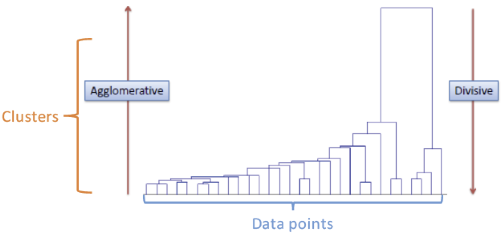
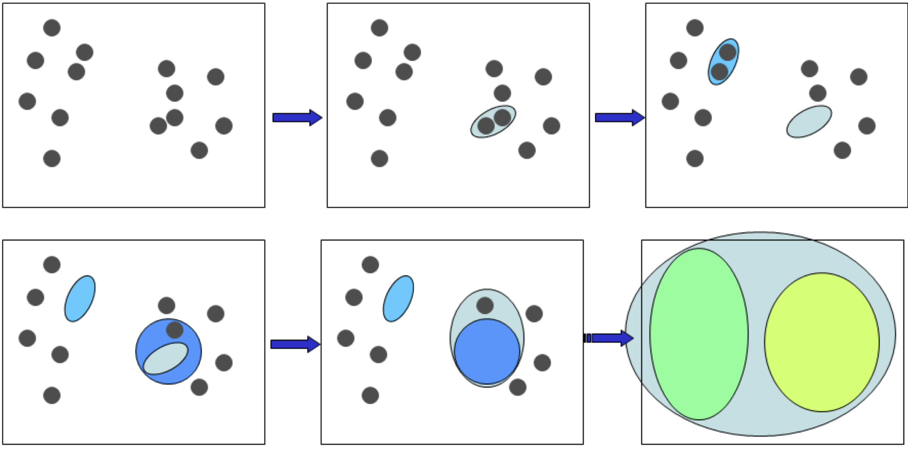
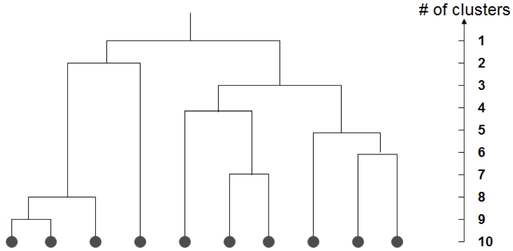
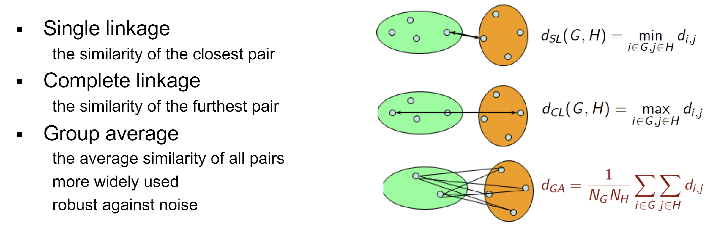

# Week 1 Extra: Hierarchical Clustering & Expectation-Maximization

04/02/2022 [KevinZonda](https://github.com/KevinZonda)

Expectation-Maximization is EM.

## Clustering

- Segment data int clusters, if:
  - high intra-cluster similarity  
    i.e., in the group, similarity is high
  - low inter-cluster similarity  
    i.e., between the group, similarity is low
- Informally, finding natural groupings among objects

### Set-up

Data: $D=\left\{x_1, x_2, \cdots, x_N \right\}$  
Each data point is m-dimensional: $x_i=<x_{i,1}, \cdots, x_{i, m}>$  
Define a *distance function* (i.e. similarity measures) between data: $d(x_i, x_j)$  
Goal: segment $x_n$ into $k$ groups: $\left\{ z_1, \cdots, z_N \right\}$ where $z_i \in \left\{ 1, \cdots, K\right\}$

### Similarity Measures/近似度测量

Euclidean:

$$
d(p, q)=d(p,q)=\sqrt{(q_1-p_1)^2+(q_2-p_2)^2+\cdots+(q_n-p_n)^2}
$$

Manhattan:

$$
d(p, q)=\sum^n_{i=1}{|p_i-q_i|}
$$

Chebyshev:

$$
d(p, q)=\max^n_{i=1}{(|p_i-q_i|)}
$$

Minkowski:

$$
d(p, q)=\left(
  \sum^n_{i=1}{|p_i-q_i|^b}
  \right)^{1/b}
$$

## Clustering Algorithms/聚类算法

### Types

- Partitional clustering. e.g. K-means, K-medoids
- **Hierarchical clustering**  
  Bottom-up (agglomerative)  
  Top-down
- Density-based clustering, e.g. DBScan
- Mixture density based clustering
- Fuzzy theory based
- Graph theory based
- Grid based
- etc.

### Hierarchical Clustering/层次聚类

- Create a hierarchical decomposition of the set of objects using some criterion （标准）
- Produce a dendrogram （树枝状图）





1. Place each data point into itw own singleton group
2. Repeat: iteratively merge the two closest groups
3. Until: all the data are merged into a single cluster

将每个 Data Point 设定为一个集（group），通过计算每个 Data Point 之间的距离，合并最近的两个。

**输出：**



```plain
Height
8       +----------------+
6   +---+---+            |
4 +-+-+     |            |
2 |   |     |            |
  *   *     *            *
  a1  a2    a3           a4

Distance between:
d(a1, a2)           = 4
d(a3, (a1, a2))     = 6
d((a1, a2, a3), a4) = 8
```

- **Output:** a dendrogram
- **Reply on:** a *distance metric* between clusters

#### Measuring distance between clusters/测量聚类间的距离



#### Strength/优势

- Provides deterministic results  
  提供确定的结果
- No need to specify number of clusters beforehand  
  不需要提前明确聚类数量
- Can create cluster of arbitrary shapes  
  可以创建任何形状的聚类

#### Weakness/劣势

- Does not scale up for large dataset, time complexity at least O(n<sup>2</sup>)  
  因为时间复杂度（最少 O(n<sup>2</sup>)），很难在大数据集使用。

#### Caveats/警告

- Different decisions about similarities can lead to vastly different dendrograms  
  不同相似算法的决策会导致截然不同的相似图像
- The algorithms imposes a hierarchical structure on the data, even data for which such structure is not appropriate  
  算法会在数据上生成一个树枝状结构，甚至这个结构不正确
