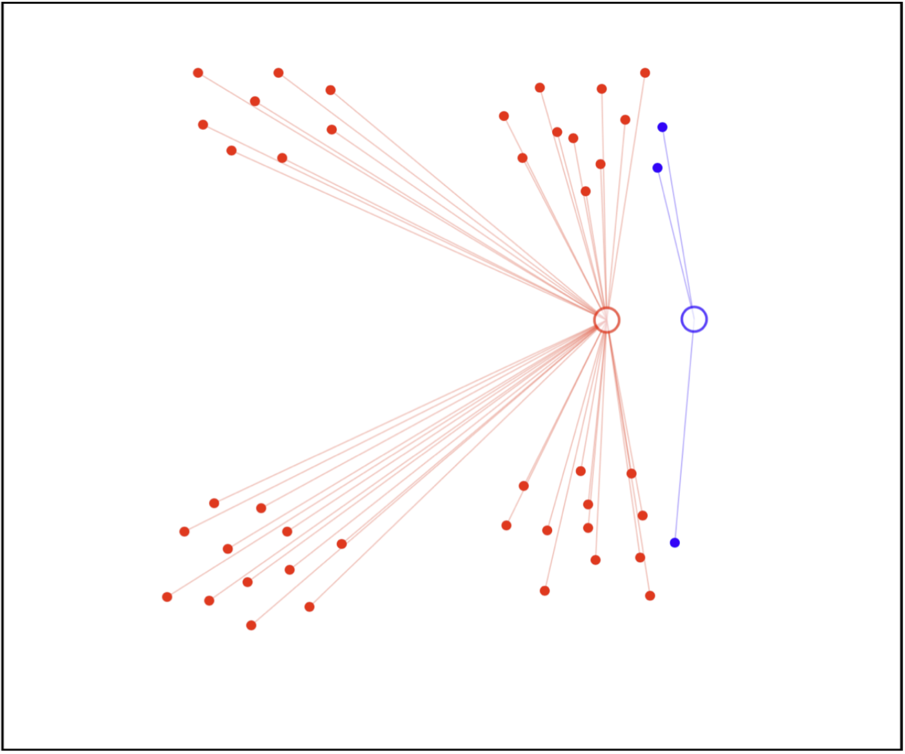
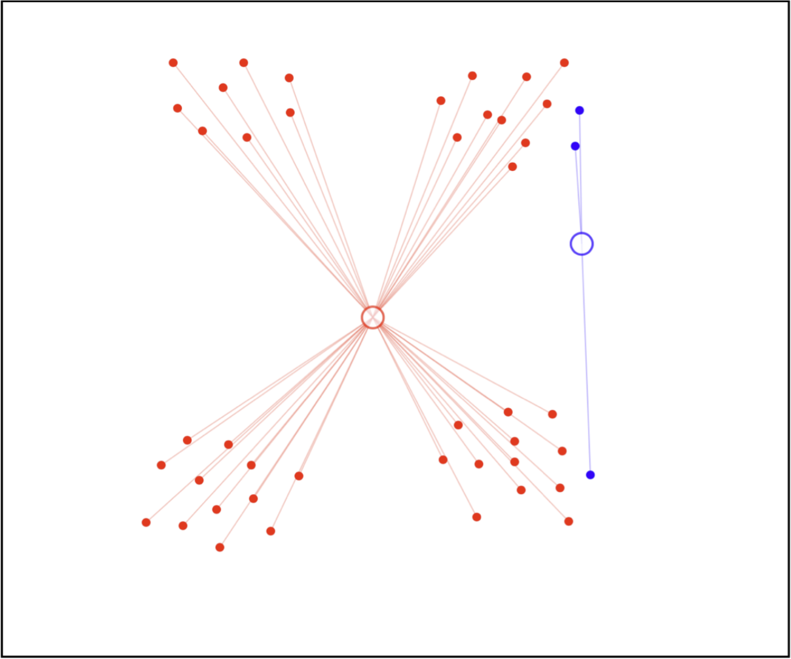
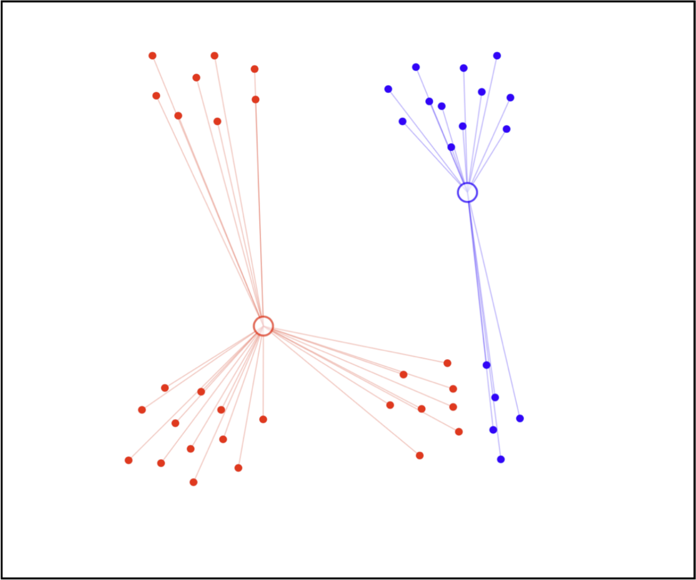
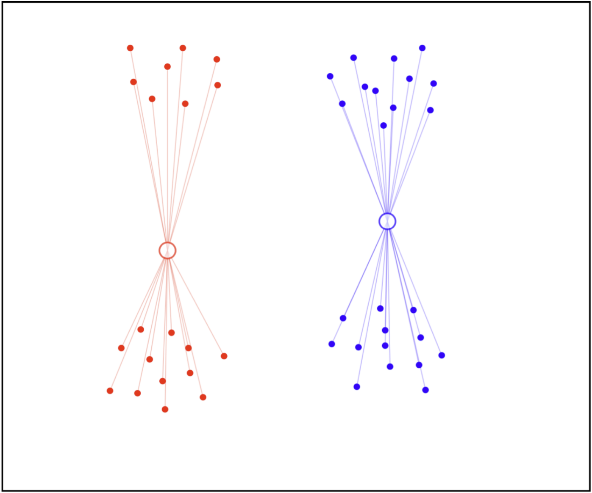
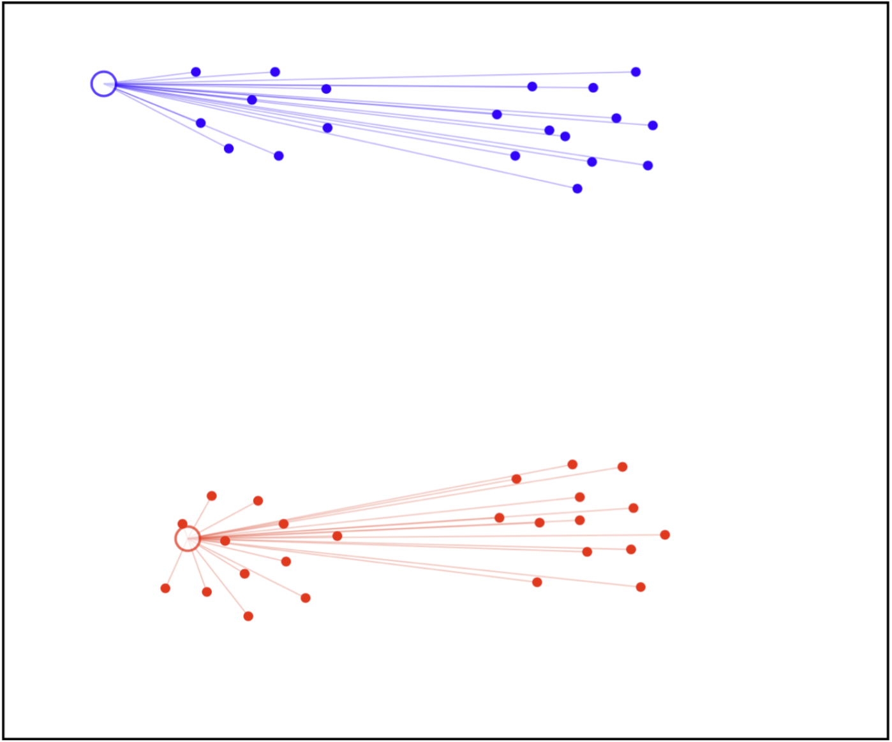
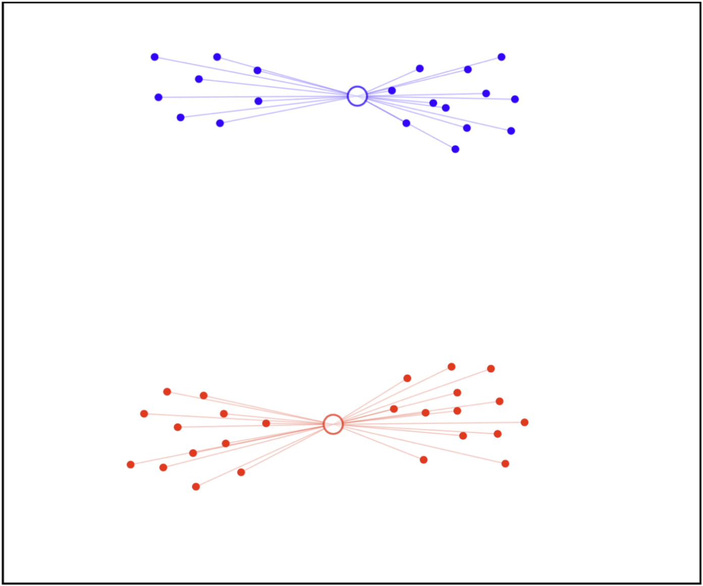
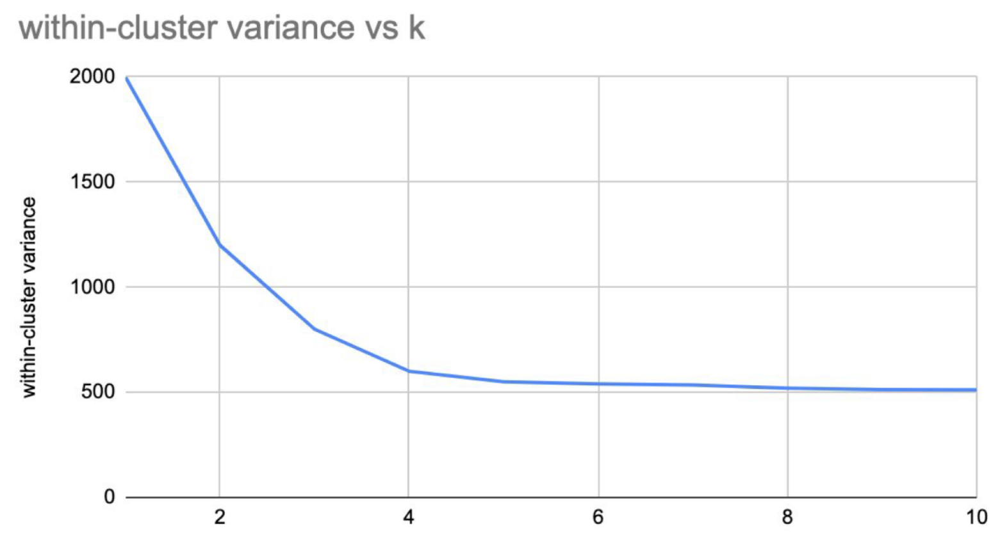

# Week 1 Extra: K-means

05/02/2022 [KevinZonda](https://github.com/KevinZonda)

## Definitions

**Centroid-based:** describe each cluster by its mean

**Goal:** assign data to K

**Algorithms Objective:** minimise the within-cluster variances of all clusters

## Steps

Assume $K=2$

### Initialise 2 clusters and assign points to clusters

1. Choose 2 random point as cluster.
2. Calculate distance between each data point and each cluster, then connect the data point to the nearest cluster.

### Adjust mean

Move the points to the centroid points.

### Reassign points to clusters & adjust mean

Consider last step, we moved the points the centroid points, the distances between data points and cluster points are changed. Therefore, we need to reassign points.

### Repeat this until no cluster changes.

After reassigning points, we might need to adjust our mean like previous step. So we just repeat these steps.

## Different Starting Points

| No  | Initial Clusters                 | Final Clusters                   |
| --- | -------------------------------- | -------------------------------- |
| 1   |       |       |
| 2   |  |  |

By setting different starting points, the clustering results would change. Therefore, we said:

- K-means is a non-deterministic method
- K-means finds a local optimal result (it is not global, so multiple restarts are often necessary)

## Algorithm

### Initialise

- **Data:** $x_{1:N}$
- Choose initial cluster means $m_{1:k}$  
  Should have the same dimension as *data*

### Repeat

#### Assign

Assign each data point to be its closest mean

$$
z_n=\arg \min_{i\in \left[1, k\right]} d(x_n, m_i)
$$

> $\arg \min$ 就是使后面这个式子达到最小值时的变量的取值

To $d(p, q)$, we use Euclidean distance:

$$
d(p, q)=d(p,q)=\sqrt{(q_1-p_1)^2+(q_2-p_2)^2+\cdots+(q_n-p_n)^2}
$$

#### Adjust

Compute each cluster mean to be coordinate-wise average over data points assigned to that cluster.

$$
m_k=\cfrac{1}{N_k}\sum_{\left\{n: z_n=k\right\}}{x_n}
$$

i.e. in each dimension $j$ of $x_i$ in cluster:

$$
\cfrac{1}{N_k}\sum_j{x_{i, j}}
$$

**Example:**

We use 2 3-D vectors $(4, 3, 7)$, $(1, 0, 9)$.

To calculate its mean, we should calculate mean od their each dimension:

$$
\begin{align}
  d_1 &= (4 + 1) \div 2 = 2.5 \\
  d_2 &= (3 + 0) \div 2 = 1.5 \\
  d_3 &= (7 + 9) \div 2 = 8
\end{align}
$$

Therefore, the mean vector is $(2.5, 1.5, 8)$.

### Until Assignments is Stable

Until assignments $z_{1:N}$ do not change.

## Finding Optimal K

Consider that $K$ should be pre-defined in this algorithm, it will lead to different result directly and will costs different.

In this case, the best point might be 4.

