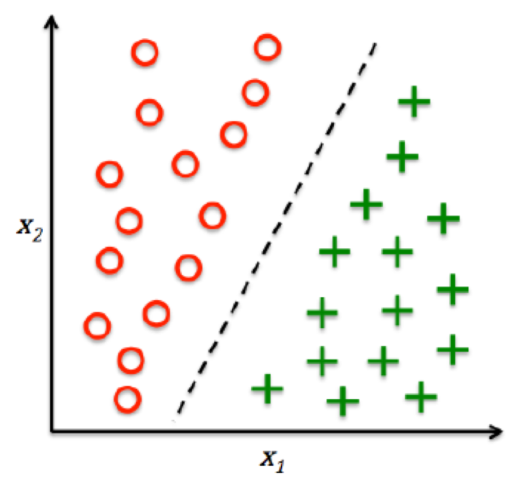
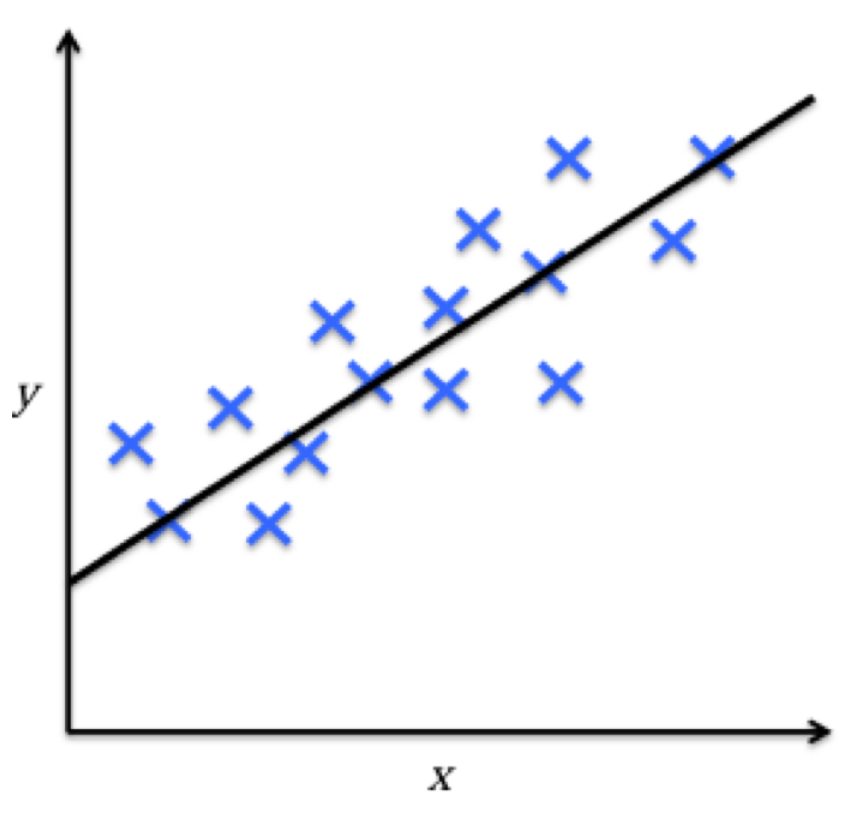
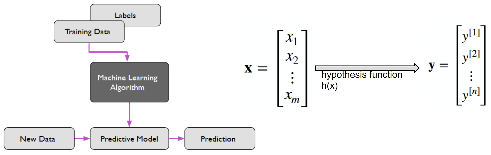
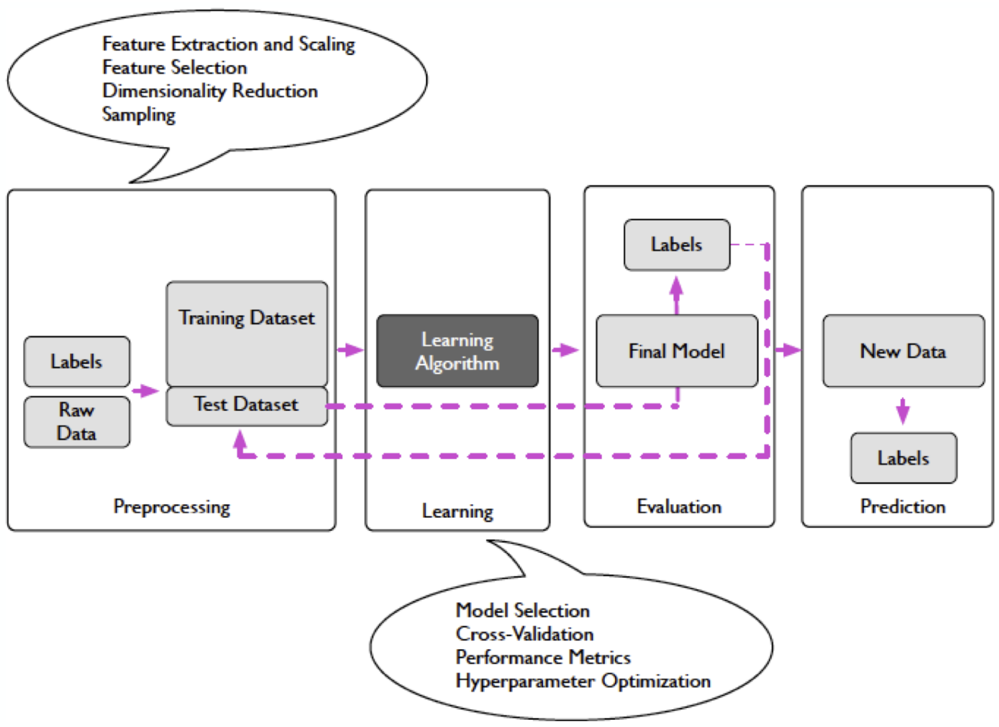
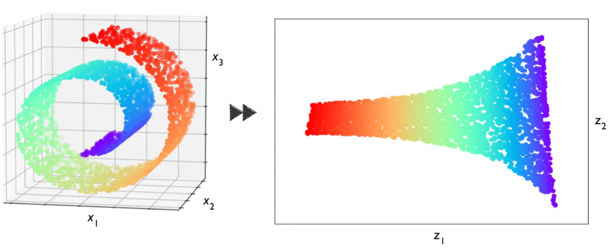
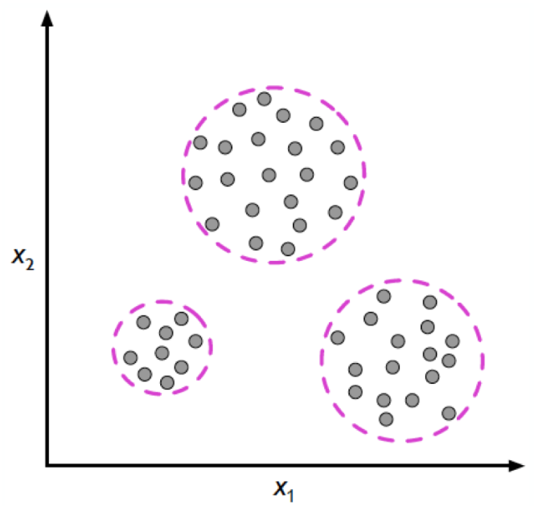
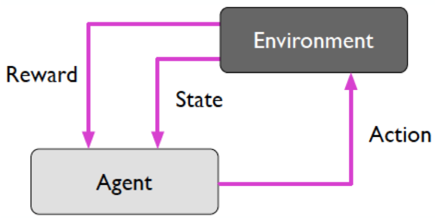
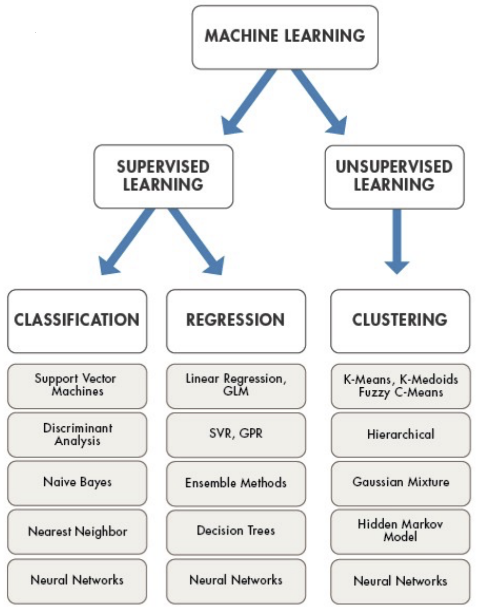

# Week 1 Extra: Machine Learning Basics

04/02/2022 [KevinZonda](https://github.com/KevinZonda)

## Definitions

"A computer program is said to learn from experience E with respect to some class of tasks T and performance measure P, if its performance at tasks in T, as measured by P, improves with experience E."
── Tom Mitchell, Professor at Carnegie Mellon University

**Task T:** classifying handwritten digits from images

**Performance Measure P:** percentage of digits classified correctly

**Training Experience E:** dataset of images of handwritten digits

## Categories of Machine Learning

### Supervised Learning/督导性学习

- Labelled data
- Predict outcome/future

|  |  |
| :-----------------------------: | :-----------------------------: |
|       **Classification**        |         **Regression**          |
| Predict categorical class label |   Predict continuous outcomes   |
|   Given Observation ⟶ Classes   |    Given Observation ⟶ Trend    |

### Unsupervised Learning

- No labels/target (could due to large dataset, etc.)
- Find hidden structure/insights in data

|          |                           |
| :---------------------------------------: | :------------------------------------------------------: |
|       **Dimensionality Reduction**        |                      **Clustering**                      |
| Reduce data sparsity & computational cost | Objectives within a cluster share a degree of similarity |

### Reinforcement learning

Learns from rewards, maximise rewards

- Decision process
- Reward system
- Learn series of actions
- Applications: chess, video games, some robots, self-driving cars

## Algorithms

## Model Evaluation

### Misclassification Error

$$
\begin{aligned}
  L(\hat{y}, y) &=\left\{
    \begin{array}{**lr**}
    0\qquad \text{if}\ \hat{y}=y\\
    1\qquad \text{if}\ \hat{y}\ne y\\
    \end{array}
  \right.\\
  \text{ERR}_{\mathscr{D}_\text{test}} &=
    \cfrac{1}{n} \sum^n_{i=1}{L(\hat{y}^{[i]}, y^{[i]})}
\end{aligned}
$$

Function $L$ means loss.

### Other Metrics

- Accuracy (1-Error)
- ROC, AUC
- Precision, Recall
- F-measure, G-mean
- (Cross) Entropy
- Likelihood
- Squared Error/MSE
- R2
- etc.
