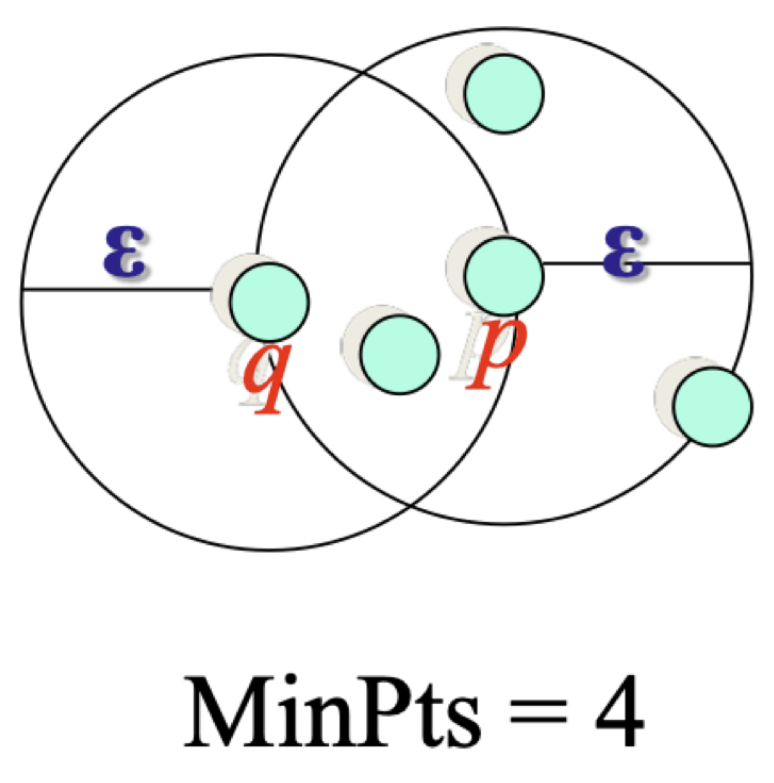

# Week 2: DBSCAN

## Overview

**Full:** Density-Based Spatial Clustering of Applications with Noise

集群是数据空间中的密集区域，被较低的样本密度区域所分隔。

一个集群被定义为一个最大的密度（density）连接点的集合。

集群可以是任意形状。

## Definition

## Parameters

1. **epsilon**: 圆的半径（radius）
2. **minPts**: 每个圆圈最少包含点的数量

## Point Type

我们定义三种 exclusive 的点的类型：

| Type           | 类型 | 描述                                             | 稀疏度                 |
| -------------- | ---- | ------------------------------------------------ | ---------------------- |
| Noise/OutlierÁ | 噪声 | 非核心也非边界的点                               | 稀疏区域/Sparse Region |
| Core           | 核心 | 是核心点的邻居，但是在搬进内拥有比 minPts 少的点 | 密集区域/Dense Region  |
| Border/Edge    | 边界 | 在半径内拥有至少 minPts 个点                     | N/A                    |

## Density-reachability/密度可及性

### Definition

#### Directly Density-reachable/直接密度可及

**Directly Density-reachable/直接密度可及**：如果 $p$ 是*核心点*并且 $q$ 在 $p$ 的邻居（neighbourhood），那么点 $q$ 是从点 $p$ 直接密度可及

##### 非对称性

如图：

- q 从 p 直接密度可及
- p 没有必要从 q 直接密度可及 （q 不是核心点）

### Density-reachability/密度可及性

- p 从 q 直接密度可及
- p2 从 p1 直接密度可及
- p1 从 q 直接密度可及

- p 从 q 间接密度可及
- q 不是从 p 密度可及

## 构成集合（簇）

如图：

- q → p1 → p2 → p 构成一个链

因此其构成一个 cluster

## 算法

1. 标记所有点类型：核心，边缘还是噪声
2. 消除所有噪声节点
3. 对于所有没有被分配到簇的核心节点 p
   - 从 p 和 所有从 p 直接密度可及的点创建一个新簇
4. 对于所有属于多于 1 个簇的边缘节点，分配其至最近的核心节点的簇

距离函数可以为欧几里得法或者其他。

## 关键点

- DBSCAN 可以找到非线性区分的簇（不限制簇的形状）
- 可以抵抗噪声
- 非确定的：边缘节点可以分配到任意簇，取决于实现

