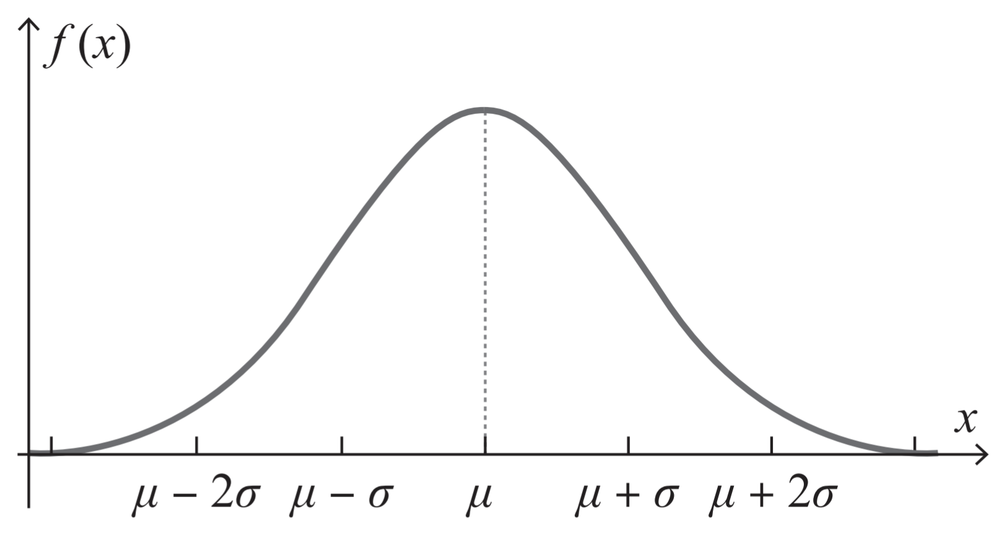

# Week 2: GMM/EM

## Probabilistic Modelling/概率模型化

Probabilistic Model, 概率模型, Aka. Statistical Model, 描述不同随机变量之间关系的数学模型。

我们将数据的抽象成对应的概率模型

## Gaussian Mixture Models/GMMs/高斯混合模型

### Gaussian Distribution/高斯分布

Probability Density Formula:

$$ f(x)=\cfrac{1}{\sqrt{2\pi}}e^{-\frac{(x-\mu)^2}{2\sigma^2}} $$

$\mu$: mean/expected value/期待值/平均值  
$\sigma$: standard deviation/标准差

### GMM Description/高斯混合模型描述

我们可以认为上图为 3 个高斯分布（正态分布）形成的，其可能是三个高斯分布的混合（Mixture）

- 假设数据是由 **一组** 高斯分布组成的
- 可能性密度（Probability Density）是他们之间的混合
- 寻找高斯分布的参数以及每个分布之间是如何构建数据的
- 这就是 GMM

### Generative Model/生成模型

Supervised Learning:
$$
p(x, z) = p(x|z)p(z)
$$

Unsupervised Learning:
$$
p(x) = \sum_z {p(x, z)} = \sum_z {p(x|z)p(z)}
$$

$z$ is hidden/latent variables

> 我们将原来的 x 拆分为 x 和 z 两个 dataset，因此我们就存在了两组

### Formulas/公式

Formula:
$$
p(x)=\sum^K_{k=1}\pi_k\mathcal{N}(x;\mu_k,\Sigma_k)
$$

$\pi$ 是混合概率，$\mu$ 是每个高斯分布的均值，$\Sigma$ 是每个高斯分布的协方差矩阵

$$
\sum^K_{k=1}\pi_k=1
\text{ and }
\pi_k\geq 0
\text{ and }
\forall k
$$

### 适配 GMM：最大化似然函数(likelihood)

#### Likelihood

为了让模型适配数据，我们需要最大化下列的似然函数

$$
\ln p(Z \mid \pi, \mu, \Sigma)=\sum^N_{n=1}\ln \left(\sum^K_{k=1}\pi_k\mathcal{N}(x^{(n)}\mid \mu_K, \Sigma_k)\right)
$$

#### EM 算法综述

**Expectation**: If we know $\pi_k$, $\mu$ and $\Sigma$, we can get $Z_k$  
$P(z^{(n)}\mid x)$ called *responsibility*.

**Maximization**: If we know $Z_k$, we can get $\pi_k$, $\mu$ and $\Sigma$

Step a, b is E-step, others are M-step

### EM Algorithm

E step:

$$
\gamma_k^{(n)}=
\frac{
    \pi_k\mathcal{N}(x^{(n)}\mid \mu_k, \Sigma_k)
}{
    \sum^K_{k=1}\pi_k\mathcal{N}(x^{(n)}\mid \mu_K, \Sigma_k)
}
$$

M step:

$$
\begin{aligned}
    \mu_k &=
        \frac{1}{N_k}
        \sum^N_{n=1}
        \gamma_k^{(n)}
        x^{(n)}
\\
    \Sigma_k &=
        \frac{1}{N_k}
        \sum^N_{n=1}
        \gamma_k^{(n)}
        (x^{(n)}-\mu_k)
        (x^{(n)}-\mu_k)
        ^T
\\
    \pi_k &= \frac{N_k}{N}
\\

    \N_k &=
        \sum^N_{n=1}
        \gamma_k^{(n)}
\end{aligned}
$$