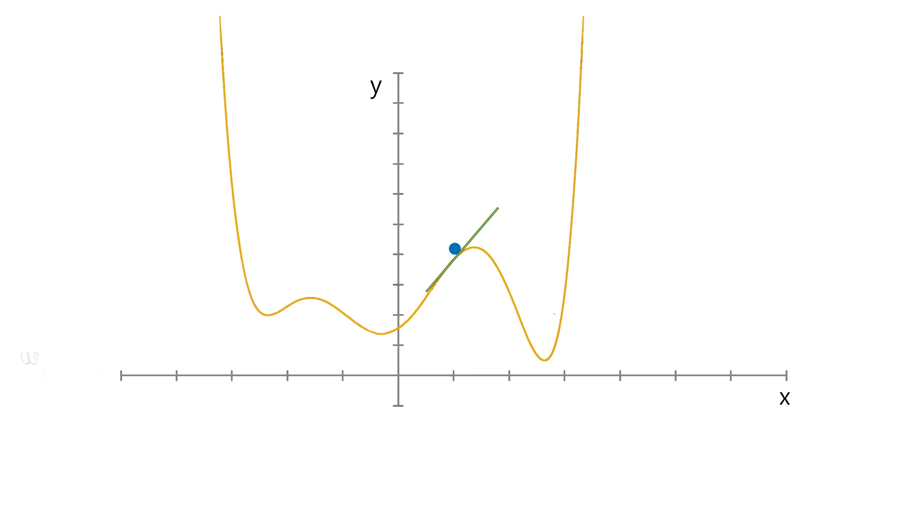

# Week 3: Gradient Descent/梯度下降

其用于最小化 Cost Func.

- 初始：$w_0 := 0, w_1 := 0$
- 重复直到没有变更：
  - 使用最陡下降方向的一小步更新 $w_0, w_1$
- 返回 $w_0, w_1$

## 通用算法

目标：最小化 Cost Func $g(w)$，$w=(w_0, w_1, \cdots, w_N)$

- 输入：$\alpha > 0$
- 初始化 $w$，使用 0 或者随机值
- 重复直到收敛/convergence：
  - $w := w - \alpha \nabla g(w)$
- 返回 $w$

$\alpha$: 步长/step size，又被称作学习率/learning rate/学习速率  
$\nabla g(w)$: 方向

## 寻找最佳方向/怎么计算 Nabla g(w)

$$
\nabla g(w) = \left(
    \begin{array}{c}
        \frac{\partial g(w_0, w_1)}{\partial w_0} \\
        \frac{\partial g(w_0, w_1)}{\partial w_1}
    \end{array}
\right)

\text{ where }

w = \left(
    \begin{array}{c}
        w_0 \\
        w_1
    \end{array}
\right)
$$

我们同样称 $\nabla g(w)$ 为 _梯度/gradient_

负的梯度评估了 $(\hat{w_0}, \hat{w_1})$，给出了最陡下降（steepest descent）的方向。
