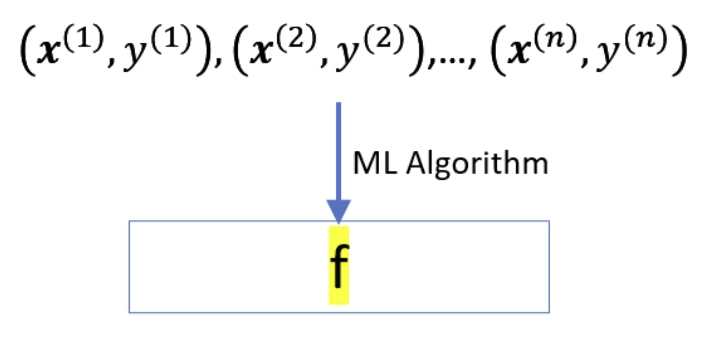
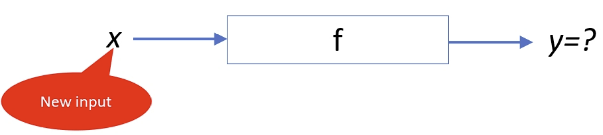
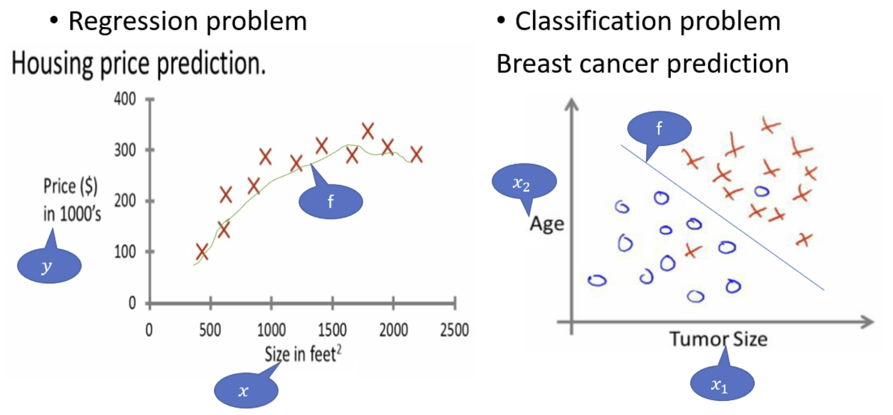

# Week 3: Introduction to Supervised Learning/监督学习介绍

## Types

- Regression/回归
- Classification/分类
  - Binary
  - Multi-class
  - etc

## 训练数据

- 监督学习需要标记好的数据
  - 一对 (Input, Output)
- 在训练完成后
  - 输入未训练的值
  - 其需要预估可能的输出

### 向量标记

$$
x^{(i)}=\left(
    x^(i)_1,
    x^(i)_2,
    \ldots,
    x^(i)_n
\right)
$$

向量内的 $x^{(i)}_n$ 又称为 attributes/特征

### 工作流

### 1. 训练 phase

### 2. 测试 & 使用 phase

### 图示

## Terminology/术语

Input = Attribute(s) = Feature(s) = Independent Variable

Output = Target = Response = Dependent Variable

Function = Hypothesis = Predictor

## 为什么 ML 那么流行

- Generality
- Adaptability
- Applicability
