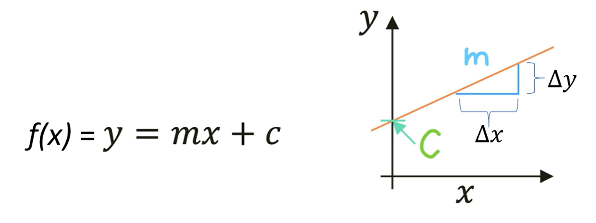
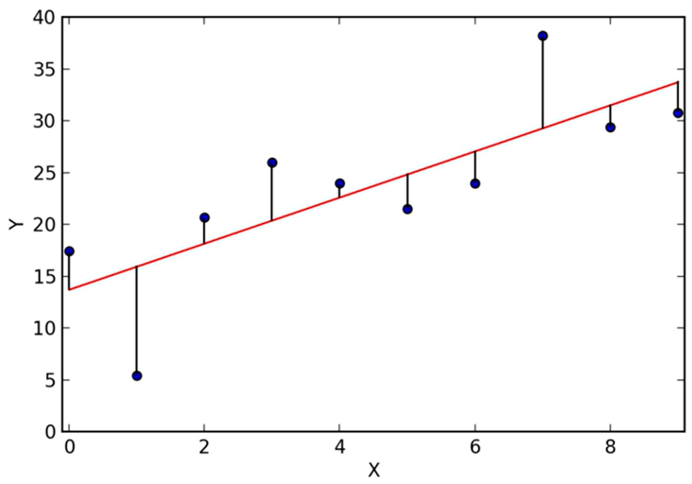
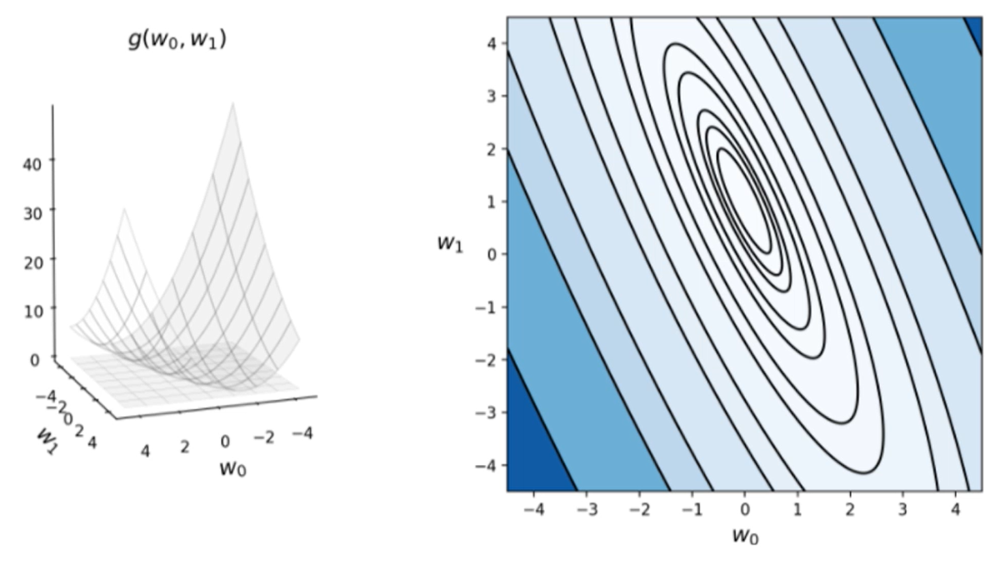

# Week 3: Linear Regression - Part 1

## Univariate Linear Regression/单变量线性回归

视觉上来说这是一个趋势。

输入：

$$
y=f(x; w_0, w_1)=w_0+w_1x
$$

$y$: dependent variable  
$w_0, w_1$: free parameters  
$x$: independent variable

$m$: slope/斜率  
$c$: intercept/截距

$$
m=\frac{\Delta y}{\Delta x}
$$

$$
\begin{aligned}
    f(x+\Delta x) &= m(x+\Delta x)+c \\
    &= mx+m\cdot\Delta x+c \\
    &= f(x)+m\cdot\Delta x
\end{aligned}
\Rightarrow
\begin{aligned}
    m &=\frac{f(x+\Delta x)-f(x)}{\Delta x}\\
      &=\frac{\Delta y}{\Delta x}
\end{aligned}
$$

## Lost Func./Cost Func.

Loss Func. = Cost Func. = Loss = Cost = Error. Func.

其是关于 free param. 的函数。

### Square Loss/L2 Loss

- Loss 表示错误，因此必须是非负数

Mean Square Error (MSE):

$$
g(w_0, w_1)=
\frac{1}{N}
\sum_{n=1}^N{
    \left(
        f(x^{(n)}; w_0, w_1)
        -
        y^{(n)}
    \right)^2
}
$$

## Summarise: What need to do

1. 给出训练集：
$$
(x^{(1)}, y^{(1)}),
(x^{(2)}, y^{(2)}),
\cdots,
(x^{(N)}, y^{(N)})
$$
2. Fit 模型
$$
y=f(x; w_0, w_1)=w_0+w_1x
$$
3. 最小化 Cost Func.
$$
g(w_0, w_1)=
\frac{1}{N}
\sum_{n=1}^N{
    \left(
        f(x^{(n)}; w_0, w_1)
        -
        y^{(n)}
    \right)^2
}
$$
