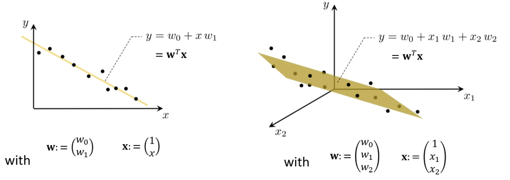
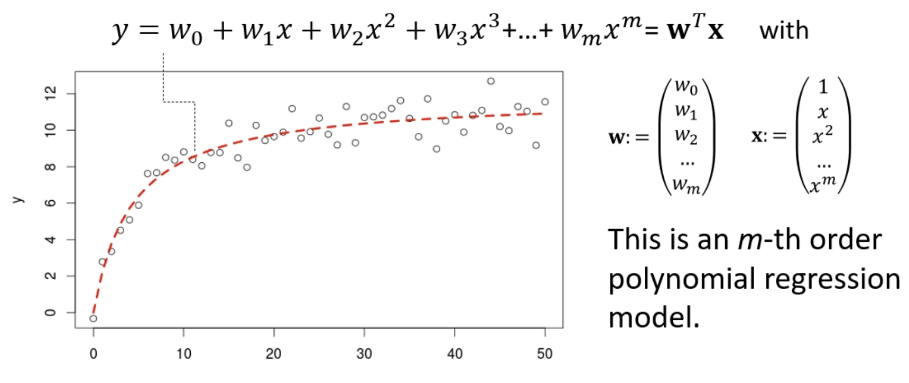

# Week 3: Linear Regression - Part 2

## Cost Func.

$$
\begin{aligned}
g(w_0, w_1) &=
\frac{1}{N}
\sum_{n=1}^N{
    \left(
        f(x^{(n)}; w_0, w_1)
        -
        y^{(n)}
    \right)^2
}
\\
&=
\frac{1}{N}
\sum_{n=1}^N{
    \left(
       (w_0+w_1x^{(n)})
        -
        y^{(n)}
    \right)^2
}
\end{aligned}
$$

By chain rule:

$$
\begin{aligned}
    \frac{
        \partial g(w_0, w_1)
    }{
        \partial w_0
    } &=
    \frac{2}{N}
    \sum_{n=1}^N{
        \left(
            (w_0+w_1x^{(n)})-
            y^{(n)}
        \right)
    }
    \\
    \frac{
        \partial g(w_0, w_1)
    }{
        \partial w_1
    } &=
    \frac{2}{N}
    \sum_{n=1}^N{
        \left(
        \left(
            (w_0+w_1x^{(n)})-
            y^{(n)}
        \right)
        x^{(n)}
        \right)
    }
\end{aligned}
$$

## Algo

- Input: $\alpha > 0$
- 初始化 $w_0 = 0, w_1 = 0$
- 重复：
  - For $n=1, ... , N$
    - $w_0 := w_0 - \alpha \cdot\left( \left(w_0 + w_1x^{(n)} \right) - y^{(n)} \right)$
    - $w_1 := w_1 -\alpha \cdot\left( \left(w_0 + w_1x^{(n)} \right) - y^{(n)} \right)x^{(n)}$
- 直到变化非常小
- 返回 $w_0, w_1$

## Multivariate Linear Regression/多元线性回归

注释：可以将 $w_0$ 看成 $w_0\times1$，因此 $x_0=1$。

多元意味着 $x$ 将会成为一个向量，而不是单一变量。

## Univariate Nonlinear Regression/单元非线性回归

## Vector Notation/向量标记

- 其是简洁 的
- 梯度是 $\nabla g(\mathbf{w})=2(\mathbf{w}^T\mathbf{x}^{(n)}-y^{(n)})\mathbf{x}^{(n)}$