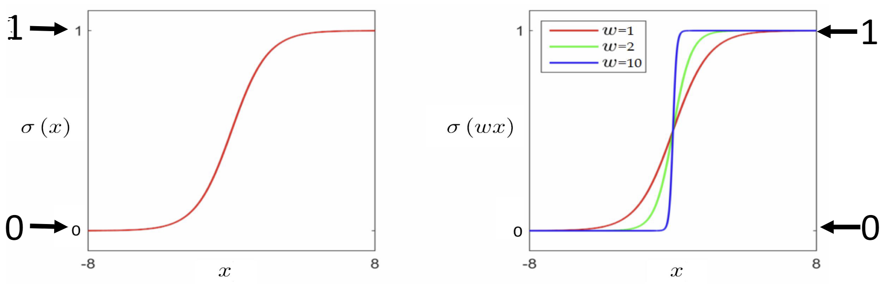
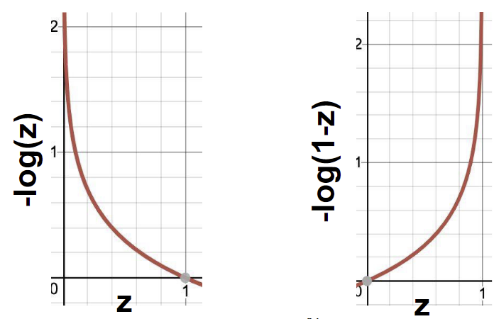

# Week 4: Logistic Regression/逻辑回归

是一个用于分类的线性模型。（分成2类）

## 前置：Sigmoid 函数/Logistic 函数

### 定义

$$
\sigma(u) = \frac{1}{1+e^{-u}}
$$

其的旋转点位于 $x$，即其决策边界。

### 含义

sigmoid 函数接受 1 个单独的参数并总是返回 0 到 1 之间的值，及

$$
\sigma(u)\in[0, 1]
$$

这意味着其在评估标签的可能性。

$$
\sigma(u) = \left\{
\begin{array}{ll}
< 0.5 & \text{Label 1}\\
=0.5 & \text{Decision Boundary}\\
> 0.5 & \text{Label 1}
\end{array}
\right.
$$

因此可以推导出

$$
\sigma(\mathbf{w}^T \mathbf{x})=\mathbb{P}(y=1\mid\mathbf{x}; \mathbf{w})\\
\Downarrow\\
1-\sigma(\mathbf{w}^T \mathbf{x})=1-\mathbb{P}(y=1\mid\mathbf{x}; \mathbf{w})=\mathbb{P}(y=0\mid\mathbf{x}; \mathbf{w})\\
$$

因此我们可以使用 Bernoulli Distribution 表示

$$
\mathbb{P}(y\mid\mathbf{x}; \mathbf{w})=\sigma(\mathbf{w}^T \mathbf{x})^y\left(1-\sigma(\mathbf{w}^T \mathbf{x})\right)^{1-y}
$$

## Model/模型

我们需要一个边缘用于区分 2 个类。

对于参数 $\mathbf{x}$:

$$
\begin{aligned}
&h(\mathbf{x}; \mathbf{w}) = \sigma(\mathbf{w}^T \mathbf{x})\\
=&\sigma(w_0 + w_1 x_1 + w_2 x_2 + ... + w_n x_n)\\
=&\cfrac{1}{1+e^{\mathbf{w}^T \mathbf{x}}}
\end{aligned}
$$

## Cost Function

我们需要评估我们通过预测函数 $h(\mathbf{x}; \mathbf{w})$
 推理出来的值与实际标签 $y$ 的损耗。

$$
Cost(h(\mathbf{x}; \mathbf{w}),y)=\left\{
\begin{array}{ll}
-\log(h(\mathbf{x}; \mathbf{w})),& \text{if } y=1\\
-\log(1-h(\mathbf{x}; \mathbf{w})),& \text{if } y=0
\end{array}
\right.
$$

为了简洁，我们可以假设 $z=h(\mathbf{x}; \mathbf{w})$

$$
Cost(z,y)=\left\{
\begin{array}{ll}
-\log(z),& \text{if } y=1\\
-\log(1-z),& \text{if } y=0
\end{array}
\right.
$$

$$
\begin{aligned}
g(\mathbf{w})&=\frac{1}{N}\sum_{n=0}^N Cost(h(\mathbf{x}^{(n)}; \mathbf{w}),y^{(n)})\\
&=\frac{1}{N}\sum_{n=0}^N \left(
    y^{(n)} \log(h(\mathbf{x}^{(n)}; \mathbf{w})) +
    (1-y^{(n)})\log(1-h(\mathbf{x}^{(n)}; \mathbf{w}))
\right)
\end{aligned}
$$

对于下式，我们又称为 cross-entropy，即交叉熵。

## Learning - Gradient Descent

$$
\nabla g(\mathbf{w})=-\left(y^{(n)}-h(x^{(n)}; \mathbf{w})\right)\cdot\mathbf{x}^{(n)}
$$

$$
\begin{aligned}
\mathbf{w}&=\mathbf{w}-\alpha\nabla g(\mathbf{w})\\
&=\mathbf{w}+\alpha\left(y^{(n)}-h(x^{(n)}; \mathbf{w})\right)\cdot\mathbf{x}^{(n)}
\end{aligned}
$$