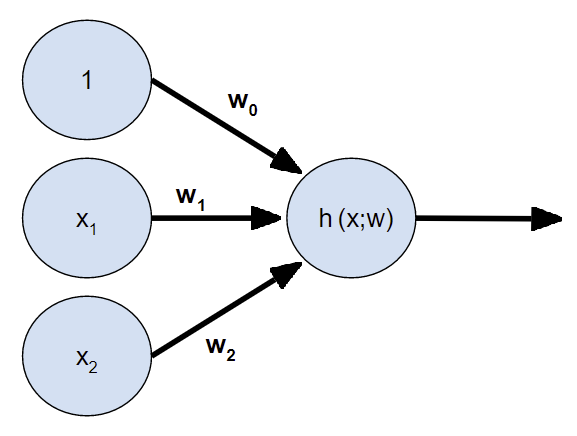
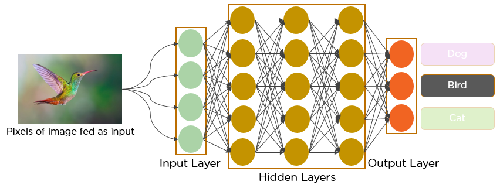

# Week 4: Neural Networks/神经网络

## 定义

- 具有许多 *free param.* 的高度非线性模型
- 可用于回归和分类，这取决于损失函数的选择。
- 可以取代实用性较差的非线性回归和非线性逻辑回归 

在 NN 中
- Model 信息
  - 有时候被称为 architecture
  - 设计这里是主要挑战
- Cost func.
  - 回归：MSE
  - 分类：logistic loss (aka. cross-entropy)
- 使用梯度下降学习
  - 使用一个 Backpropagation （反向传播） 算法
  - 概念上，每一个反向进行一次梯度下降步骤

## NN Model

- 每个节点是 1 个 单元（unit）或神经元（neuron）
- 没一个箭头表示又权重的连接
- 节点被布置在层（layers）中
  - 1 层输入层（input layer）
  - 1 层输出层（output layout）
  - 任意层（0, 1, 2, ...）隐藏层（hidden layers）
- 隐藏和输出节点通常使用一个 sigmoid 或者其他激活函数（activation function）

## 最简单的 NN

- 没有隐藏层的 NN 被称为感知器（perceptron）
- 如果激活函数为 sigmoid 则此模型等价于 logistic regression

$$
h(\mathbf{x}, \mathbf{w}) = \sigma(w^T \mathbf{x})
$$

## 多层感知器/Multi-layer Perceptron

如果我们拥有 1 层隐藏层，则模型被称为*多层感知器（multi-layer perceptron）*

- 其为非线性模型
- Parameters: 权重
- Hyperparameters: 隐藏单元的数量，激活函数的选择
- 输出节点的数量 = 目标/需要预测标签的数量

## 深度神经网路/Deep Neural Networks

- 当隐藏层多于 1 则为 DNN。
- 隐藏层的数量同样是 hyperparameter。

### 激活函数/Activation functions

用途：加权求输入的和

- Sigmoid
- Tanh
- ReLu
- etc.

### 优势

对比 1 层隐藏层：
- 1 层隐藏层需要大量神经元，训练时间成本大
- 更多的隐藏层在实践中工作更好
- 模拟人类视觉
- 不需要 hand-craft 输入 attribute
