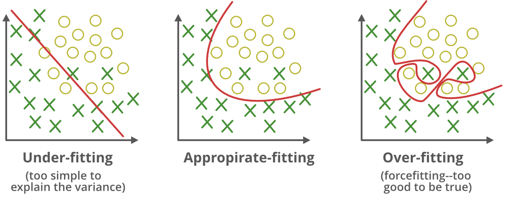
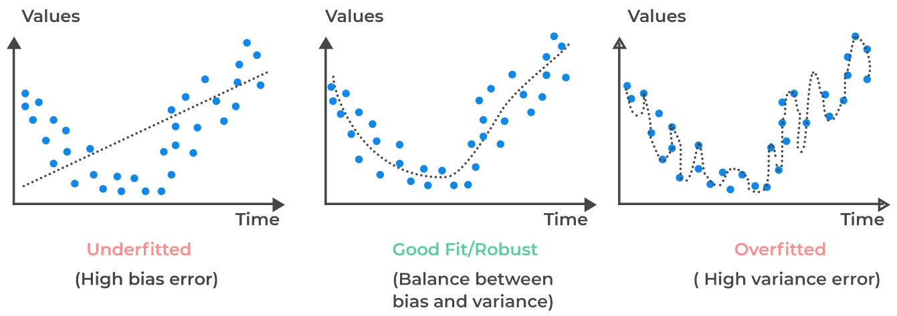

# Week 4: Overfitting/过拟合

## Overview

拟合训练数据过好是**不好的**。因为需要进行分类或者预测的数据与训练数据不同，因此学习不相干的细节（噪声数据）不会有任何帮助。

过拟合发生在模型比需求更加复杂。

## Regularisation

- 神经网络和所有非线性模型都可以过拟合数据。
- 我们可能甚至需要 regularise 线性模型（例如有太多噪声数据）

### 方法

- 在 cost func 中增加一个惩罚（penalty），以惩罚更复杂的模型
  - 例如 free param. 的数量，巨大的权重
- 精简（prune）模型
  - Dropout 是在训练深度网络时“移除”一定比例的节点

### Early Stopping

- 及早停止训练是另一个防止过拟合的方法
- 在每次梯度更新（或Backprop循环）后，训练 cost 将减少，直到达到 0。
- 留出一个数据子集（称为 hold-out set），只用于监测以前未见过的数据的 cost。
- hold-out set 上的误差一开始会减少，但随着训练的继续，它可能开始增加。
- 当 hold-out set 的误差开始增加时，停止训练