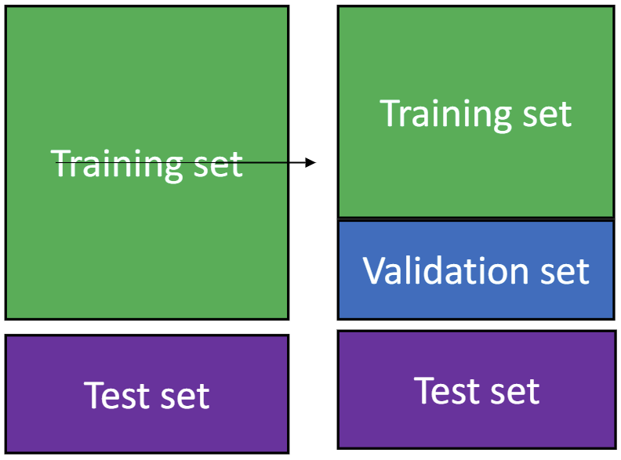
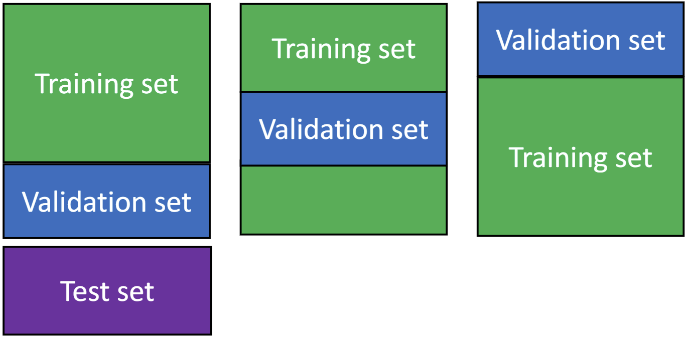
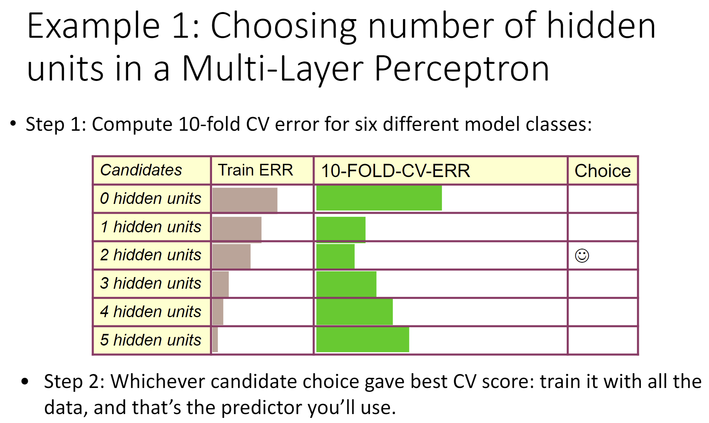
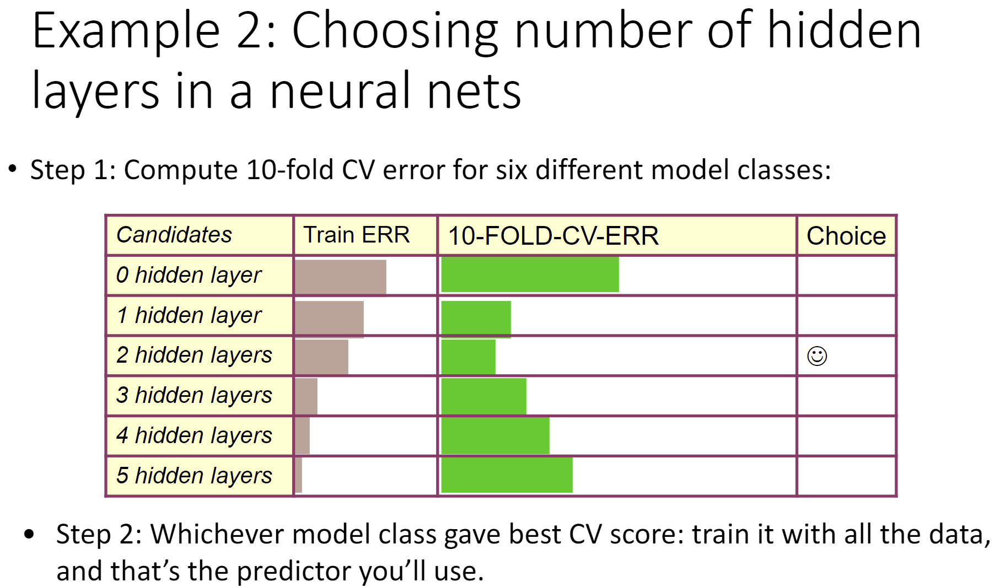
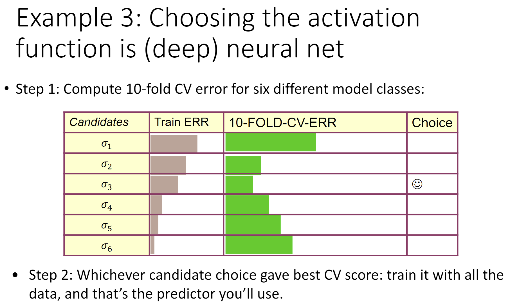
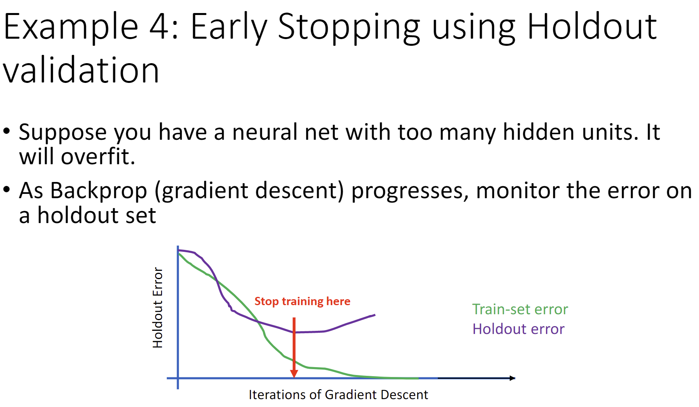

# Week 5: Evaluation & Hyperparameter Tuning

## Evaluation

我们总是分割可用标记好的数据随机为：
- 训练集/Training Set：用于训练
- 测试集/Test Set：用于在部署前评估模型性能

## 为模型选择而评估模型

核心思想：拆分训练集为训练集和验证集（Validation Set）

为什么不用测试集？如果使用了，那我们没有非依赖数据集取评估最终模型了。

方法：
- Holdout Validation
- Cross-validation
- Leave-one-out-validation

## Holdout Validation

1. 以 3:7 拆分验证集和训练集
2. 使用训练集训练模型
3. 使用验证集评估每个模型的性能
4. 选择最低验证错误的模型
5. 使用选择的模型使用全部数据集（联合验证集和训练集）进行训练
6. 使用测试集评估模型性能
7. 准备部署

对于使用验证集评估性能在回归和分类上是不同的：
- 回归：我们计算 cost func
- 分类：计算 0-1 Error Metric:  
  $\cfrac{\text{Number of Wrong Predictions}}{\text{Number of Predictions}}=1-\text{Accuracy}$

## k-fold Cross-validation

1. 将训练集随机分成k个（大小相等的） 不相交的集合(在这个例子中，k=3)
2. 使用其中的 k-1 份同时进行训练
3. 使用剩下的一份进行验证
4. 交替 k 个集合并重复 k 次
5. 计算在 k 个验证集合上的平均性能

## Leave-one-out validation

1. 我们 leave out 一个样本用于验证，并对所有其他的注释数据进行训练。
2. 对于总共 N 个样本，我们重复 N 次，每次都 leave out 一个样本。
3. 计算在 leave-out 点上测量的验证误差的平均值

- 与 k-fold Cross-validation 相同，其中 N 是标记点的数量

## 优劣势

|               | 优势                   | 劣势                                                  | 适用   |
| ------------- | ---------------------- | ----------------------------------------------------- | ------ |
| Holdout       | 算力需求最低           | 如果样本数量不够，最不可靠                            | 大样本 |
| 3-fold        | 比 holdout 更可靠      | 丧失了 1/3 标记的数据 是 Holdout 计算成本的 3 倍   | ~      |
| 10-fold       | 仅浪费 10% 相当可靠 | 丧失了 1/10 标记的数据 是 Holdout 计算成本的 10 倍 | ~      |
| Leave-one-out | 不浪费数据             | 计算成本是最高的                                      | 小样本 |

## 使用 Model Validation 调整 Hyperparameters

