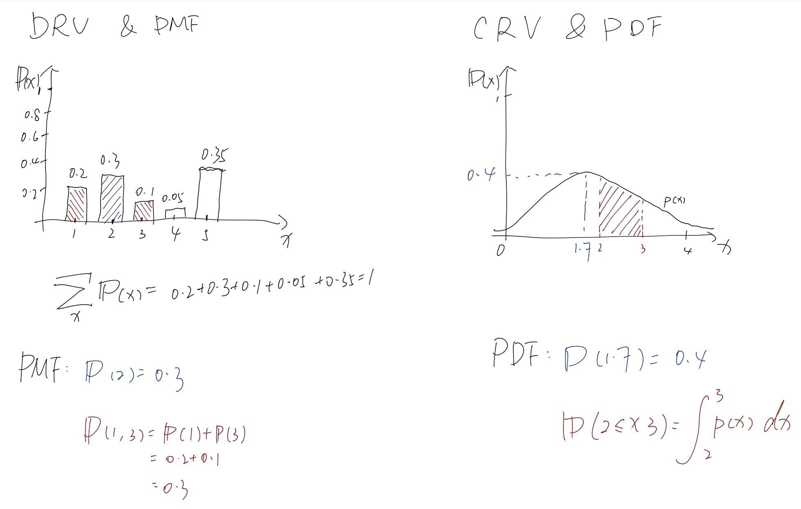

# Week 6: Probability

## Definition

**概率模型（Probabilistic model）**： 描述一个未确定的状态
- 样本空间 $\Omega$（Sample Space）：所有可能结果的集合
- 概率法则（probability law）：事件集合 A 发生的概率，被记作 $P(A)$

概率模型的基本过程被称为实验（experiment）

**事件（Event）**：样本空间的子集

**离散型随机变量（Discrete Random Variable）**：取值是可数的个值的随机变量， 比如投掷一枚骰子的朝上的点数，可能是1,2,3,4,5,6；比如南京大学四食堂吃饭的人数，可能是0,1,2···。

**连续型随机变量（Continuous Random Variable）**：取值是一个区间中的任意一点（也就是不可数）的随机变量，比如南京大学同学身高。

**Probability Mass Function/PMF**：计算这个 DRV 发生的概率的可能性。

**Probability Density Function/PDF**：计算这个 CRV 发生的概率。

## DRV, PMF, CRV & PDF

## 公理/Axioms

- 非负性/Nonnegativity: $\forall A.\ P(A) \geq 0$
- 相加性/Additivity：$A\cap B=\emptyset\to P(A\cup B)=P(A)+PB$
- 正常化/Normalisation：$P(\Omega)=1$

## Notation

| Type                         | Notation           | E.g.                                |
| ---------------------------- | ------------------ | ----------------------------------- |
| DRV/Discrete Random Variable | 大写字母           | $X$                                 |
| Values                       | 小写字母           | $x\in\{\text{True}, \text{False}\}$ |
| Vectors                      | 粗体大写或包含上标 | $\mathbf{X}, \vec{X}$               |
| PMF                          | See E.g.           | $p_X(x)$                            |

## Unconditional/Conditional Probability

- Uncon (Prior): $P(X)$
- Con (Posterior): $P(X\mid X_1=\cdots)$ (Consider the case of $X_1=\cdots$ is the condition)

## Joint Probability

$P(X, Y)=P(X\mid Y)P(Y)=P(Y\mid X)P(X)$

理解：$P(X,Y)=P(X\cap Y)$，换句话说就是当 X 和 Y 都发生的时候的概率。因此我们可以计算当 Y 时，X的概率 $P(X\mid Y)$ 用其乘上 Y 的概率 $P(Y)$。

## Mean, Variance & Stand. Deviation

### Mean (or Expected or Expectation, $\mu$)/期望

$$
E(X)=\sum_x{xp_X{(x)}}
$$

对于随机变量 $X$，遍历其所有值 $x$，将其值与其概率相乘并取其和。

例如

| x    | 1   | 2   | 4   | 7   |
| ---- | --- | --- | --- | --- |
| p(x) | 0.1 | 0.2 | 0.2 | 0.5 |

$E(X)=1\times 0.1+2\times 0.2 +4\times 0.2+7\times 0.5=0.1+0.4+0.8+3.5=4.8$

### Variance/方差

其提供了一个计算离散程度（dispersion）的函数。

$$
var(X)=\sum_x{(x-E(X))^2p_X(x)}
$$

### Standard Deviation/标准差

$$
\sigma_X=\sqrt{var(X)}
$$
