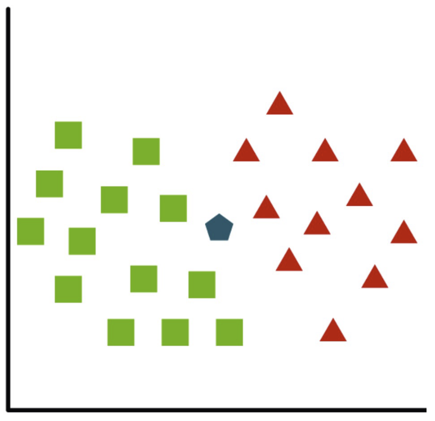
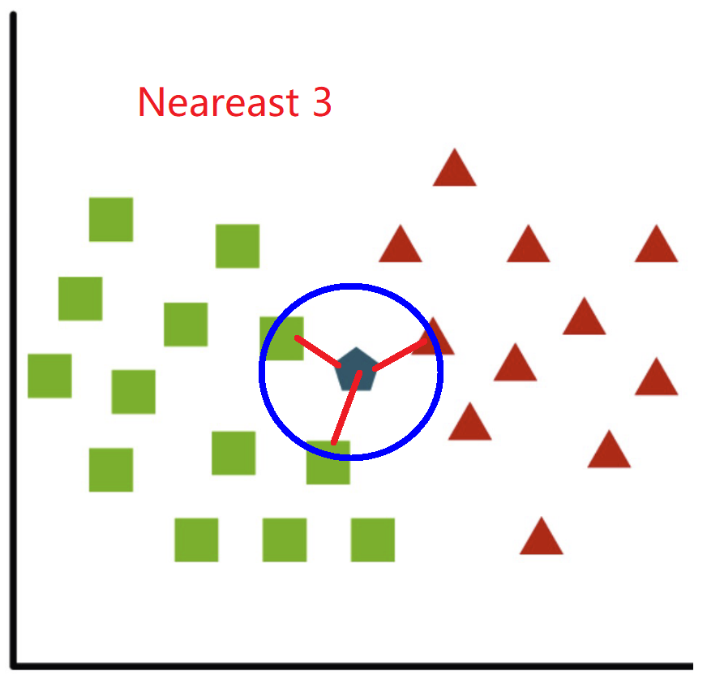
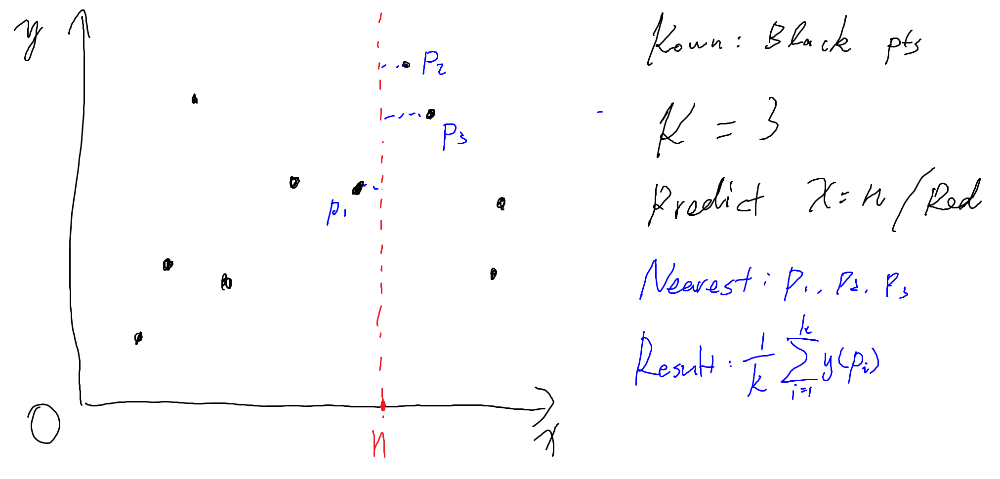

# Week 6: k-Nearest Neighbours

## Distance func.

### Minkowski Distance

$$
L^p(\mathbf{x}^{[q]}, \mathbf{x}^{[i]}) =\sqrt[p]{ \sum_{j=1}^n \left| x_j^{[q]} - x_i^{[i]} \right|^p}
$$

### Euclidean

p=2's Minkowski Dist.

## Algo.

### Classification

|  |  |
| -------------------- | ---------------------- |

已知绿色和红色集合，评估五边形的类型。

- 设定 k 值
- 评估每个点到五边形的距离并排序
- 寻找出前 k 个最近的点
- 评估其中比例（例如 k = 3，其中 2 个为绿色，1个为红色，则分配至绿色集合）

### Regression

## Problem with Numeric Independent Var.

对于线性回归，由于我们输入的都是数字型的变量，因此假设：
- $x_1\in[0, 1]$
- $x_2\in[1, 10]$

通常来说，$x_2$ 会影响更多。

因此我们需要对其进行 Normalisation

$$
Normalisae(x_j^{[i]})=\frac{x_j^{[i]}-\min_j}{\max_j-\min_j}
$$

或者

$$
Normalisae(x_j^{[i]})=\frac{x_j^{[i]}-\mu_j}{\sigma_j}
$$

例如

|           | $x_1$ | $x_2$ | $y$ |
| --------- | ----- | ----- | --- |
| $x^{[1]}$ | 14    | 70    | Y   |
| $x^{[2]}$ | 12    | 90    | N   |
| $x^{[3]}$ | 15    | 66    | Y   |

$$
Normalise(x_1^{[1]})=\frac{14-12}{15-12}=\frac{2}{3}
\\
Normalise(x_2^{[1]})=\frac{70-66}{90-66}=0.167
$$

## Summarised Algo

- 输入
  - 训练集 $(x^{[i]}, y^{[i]})$
  - 查询点 $x^{[q]}$
  - 参数 $k$
- 输出
  - 预估值
- 对于每个训练样例 $x^{[i]}\in \mathbf{x}$
  - 计算其与查询点 $x^{[q]}$ 的距离（如果是 Normalisation，则为 normalised distance）
  - 保持 k 个距离最近的节点
- 返回最佳值（如果是classification，则为 vote 最多的class，如果是regression则为 avg/median）

对于输入参数的距离处理：
- Numeric：使用距离函数
- Ordinal：转换为Numeric（T->1, F->0）
- Categorical：如果类别相同返回 0，否则返回 1

## Pros & Cons

### Pros

- 训练简单速度快：只是存储数据
- 基于最相似的数据进行分类

### Cons

- 使用大量内存
- 如果是多维数据，速度可能慢
