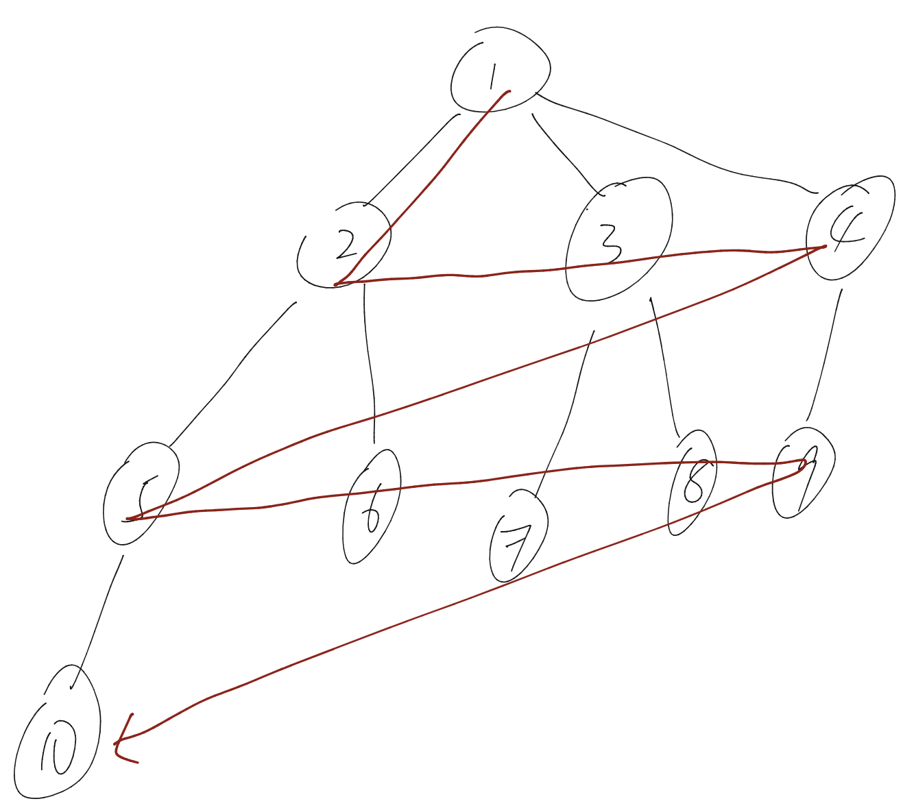
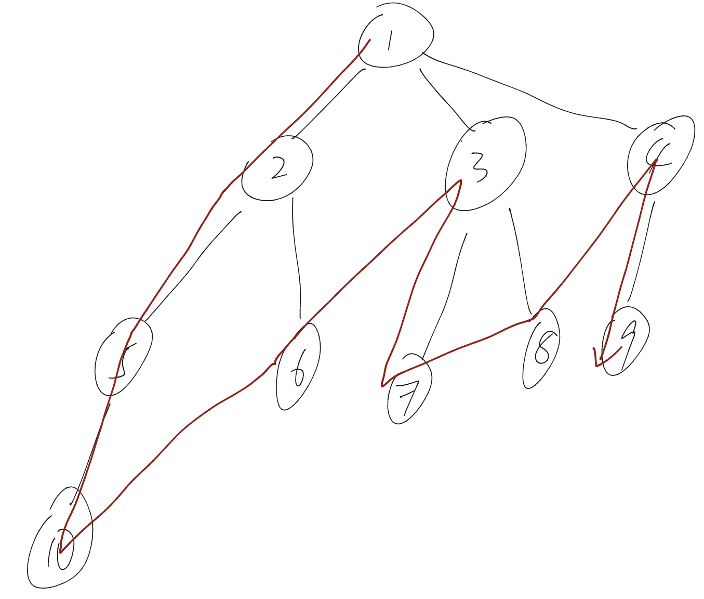
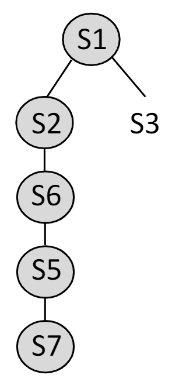
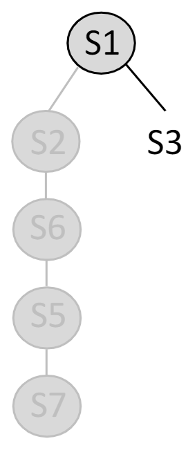

# Week 7: Uninformed Search

## Asymptotic Analysis/渐进式分析

瞅瞅大O，大Omega和Theta notation

## Definition

agent：在一个环境中感知和行动的东西

Problem-Solving Agents
- 使用原子表示（环境的每个状态都被认为是不可分割的）
- 要求对问题及其目标/解决方案进行精确定义

Problem formulation：是决定在给定目标的情况下考虑哪些行动和状态的处理

## Search Problem Formulation

### Assumption

为此，我们对环境做了以下假设
- Observable/可观察的，即 agent 知道当前的状态
- Discrete/离散的，即在任何状态下都只有有限的行动
- Known/已知的，即 agent 知道每个行动会到达哪些状态
- Deterministic/决定性的，即每个行动都有确切的一个结果

### Problem Def

- The agent’s task is to find out how to act, now and in the future, in order to reach a goal state: namely to determine a sequence of actions
- The process of looking for a sequence of actions is called search
- A solution to a search problem is the sequence of actions from the 
initial state to the goal state

这个问题被一下进行正式定义：

- Initial state/初始状态，即 Agent 开始时的状态
- Action/行动，即对在给定状态下可执行的所有可能行动的描述
- Transition model/过渡模型，即从每个状态执行每个行动所产生的状态（每个行动的描述）。
- Goal test/目标测试，以确定一个状态是否是目标状态
- Path cost/路径成本，为每个路径分配一个值（成本）。

## Measuring Performance

- Completeness/完备性, 是否算法确保可以找到一个 solution（如果有）
- Optimality/最优性, 该策略是否能够找到最佳解决方案
- Time complexity/时间按复杂度, 算法找到解决方案所需时间
- Space complexity/空间按复杂度, 算法找到解决方案所需内存

在下文使用如下参数进行量化：
- 分支因子/Branching factor：每个节点的最大继承者数量 $b$
- 最浅目标节点的深度（从根部开始的步骤数）$d$
- 状态空间中任何路径的最大长度：$m$

## Breadth-First Search/BFS/广度优先搜索

- 完备性：如果深度 $d$ 和 分支数 $b$ 均为有限，则完备
- 最优性：如果路径成本是节点深度的一个非递减函数则为最优的
- 时间复杂度：$O(b^d)$

## Depth-First Search/DFS/深度优先搜索

- 完备性：如果搜索空间是无限的或者我们不检查无限循环，DFS就不完备；如果搜索空间是有限的，DFS就完备。
- 最优性：DFS不是最优的，因为当目标节点在右子树的第一层时，它可以扩展左子树。
- 时间复杂度：$O(b^m)$，因为它取决于搜索空间中路径的最大长度（一般来说，$m$ 可以比 $d$ 大很多）
- 空间复杂度：$O(b^m)$

## DFS 的变种

### DFS 的问题

- 非最优的
- 高时空复杂度

### Less Memory Usage Var.

|  |  |
| ------------------- | ------------------- |

当 S2 路径展开完毕 ，并开始展开 S3 时候，删除已经存在的 S2 路径。从而降低内存占用。

因此其空间复杂度可以为 $O(bm)$

### Depth-Limited Search/DLS/深度限制搜索

我们每次最深搜索深度为 $\mathbb{l}$。

因此
- 时间复杂度：$O(b^l)$
- 空间复杂度：$O(bl)$
- 最优性：当 $l \ge d$，则非最优

## Compare

|            | BFS      | DFS      | DFS (less mem) | DLS  (Less Mem) |
| ---------- | -------- | -------- | ----------------- | ------------------ |
| 完备性     | ✔️*       | ✔️***        | ✔️***                 | ✔️                  |
| 最优性     | ✔️**      | ❌        | ❌                 | ❌                  |
| 时间复杂度 | $O(b^d)$ | $O(b^m)$ | $O(b^m)$          | $O(b^l)$           |
| 空间复杂度 | $O(b^d)$ | $O(b^m)$ | $O(bm)$           | $O(bl)$            |

- \* If b is finite
- \*\* If the path cost is a nondecreasing function of the depth of the node (e.g., all actions have the same cost)
- \*\*\* If the search space is finite (also, loopy paths are removed)